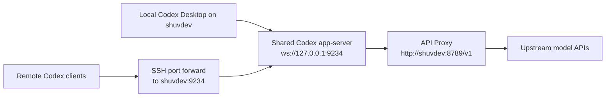

# Shared Codex App-Server Architecture

This system is built around a single dedicated Codex app-server running on `shuvdev`.

The goal is to centralize app-server execution, proxy configuration, and upstream API access so that multiple Codex clients can share one backend process. In this model, clients do not manage their own app-server instances and do not need separate direct upstream API configuration.

## Overview

- A systemd user service keeps one shared Codex app-server running on `shuvdev`.
- That app-server listens on `ws://127.0.0.1:9234`.
- The local Codex Desktop client on `shuvdev` connects to that websocket listener.
- Remote Codex clients connect to the same listener through SSH port forwarding.
- The shared app-server is the only component that holds proxy-backed upstream API configuration.
- All upstream API traffic is routed through our proxy.

## Components

### Shared app-server

The dedicated app-server is launched by:

- [`/home/shuv/.config/systemd/user/codex-shared-app-server.service`](/home/shuv/.config/systemd/user/codex-shared-app-server.service)

That service runs:

- [`/home/shuv/.local/bin/codex-shared-app-server`](/home/shuv/.local/bin/codex-shared-app-server)

The shared app-server script:

- loads proxy-related environment values from local config files
- maps proxy values into `OPENAI_*` and `CODEX_*` variables
- syncs Codex API-key auth into the CLI runtime
- starts `codex app-server`
- binds the websocket listener to `ws://127.0.0.1:9234`

### Local desktop client

The local desktop launcher is:

- [`/home/shuv/.local/bin/codex-desktop-linux-walker`](/home/shuv/.local/bin/codex-desktop-linux-walker)

That wrapper:

- loads the same proxy-related environment files
- maps proxy values into the desktop runtime environment
- points the desktop app at the shared websocket endpoint with `CODEX_APP_SERVER_WS_URL=ws://127.0.0.1:9234`
- avoids letting the desktop app manage its own dedicated listener lifecycle

### Remote clients

Remote clients do not connect directly to upstream APIs. Instead, they open an SSH tunnel to `shuvdev` and forward a local port to the shared app-server listener on `127.0.0.1:9234`. From the client point of view, they are still just speaking websocket to a Codex app-server. The difference is that the app-server process lives centrally on `shuvdev`.

## Request Flow

1. A local or remote Codex client connects to the shared websocket endpoint.
2. The shared app-server receives the client request.
3. The shared app-server applies the proxy-backed upstream configuration already loaded into its environment.
4. The shared app-server sends the upstream API request through the proxy.
5. The proxy forwards the request to the upstream model API.
6. The response returns through the proxy, back to the shared app-server, and then back to the client over websocket.

## Proxy Model

This architecture intentionally centralizes upstream credentials and routing.

- Clients connect only to the shared app-server.
- The shared app-server is the component that knows about the proxy base URL and proxy token.
- Upstream model/API traffic is routed through the proxy endpoint, currently `http://shuvdev:8789/v1`.
- This avoids per-client direct API configuration and keeps upstream routing consistent across local and remote users.

## Login/Auth Model

This is not a normal direct ChatGPT-login-per-client setup.

In shared-server mode:

- clients are expected to use the shared app-server
- clients should not need their own separate app-server instance
- clients should not need their own direct upstream API configuration
- the shared app-server is the point where proxy-backed auth is applied

## Diagram

## Operational Summary

The effective shape of the system is:

- one systemd-managed shared Codex app-server on `shuvdev`
- many local and remote clients connected to that one app-server
- one proxy path for all upstream API calls

This gives us a single place to manage websocket serving, proxy routing, and upstream API access while allowing multiple Codex clients to share the same backend service.
